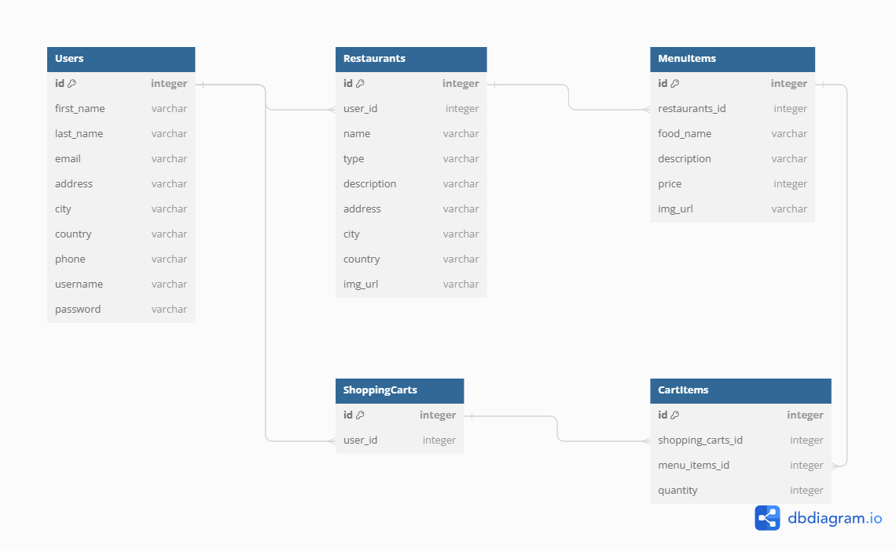

# Flask React Project

Schema:

[Render.com]: https://ue-project.onrender.com/

# User Stories
## As a user:

1. Users should be able to view all restaurants for delivery.
 
    - As a hungry user, I want to be able to easily browse through a list of all restaurants available for delivery so that I can choose where to order food from.

2. Users should be able to view all menu items for a restaurant.
 
    - As a hungry user, I want to view all the items available on a restaurant's menu so that I can decide what to order.

3. Users should be able to view all products added to their cart.
 
    - As a hungry user, I want to easily view all the products I've added to my shopping cart so that I can review my order before checkout.

4. Users should be able to add products to their shopping cart.
 
    - As a hungry user, I want to be able to add products to my shopping cart with just a few taps, making the ordering process quick and convenient.

5. Users should be able to remove products from their shopping cart.
 
    - As a hungry user, I want the option to remove products from my shopping cart if I change my mind or want to make adjustments to my order.

6. Users should be able to preform a "transaction" to complete their purchase.
 
    - As a hungry user, I want a seamless checkout experience where I can complete my purchase with minimal hassle or confusion.
---------------------------------------------------------------------------------------------------------------------------------------

## As an owner:

1. Users should be able to create a restaurant.
 
    - As a restaurant owner, I want to be able to create a profile for my restaurant on the app, including adding details such as cuisine type, menu items, and delivery options.

2. Users should be able to update their restaurant(s).
 
    - As a restaurant owner, I want the ability to update my restaurant's information, including changing operating hours, updating menu items, or adding special promotions.

3. Users should be able to delete their restaurant(s).
 
    - As a restaurant owner, I want the option to delete my restaurant profile from the app if I no longer want to offer delivery services.

4. Users should be able to add menu items to their restaurants.
 
    - As a restaurant owner, I want to be able to add new menu items to my restaurant's profile, including details like price, description, and availability.

5. Users should be able to update menu items on their restaurants.
 
    - As a restaurant owner, I want the ability to update existing menu items, such as changing prices or descriptions.

6. Users should be able to delete menu items from their restaurants.
 
    - As a restaurant owner, I want to be able to remove menu items from my restaurant's profile if they are no longer available.